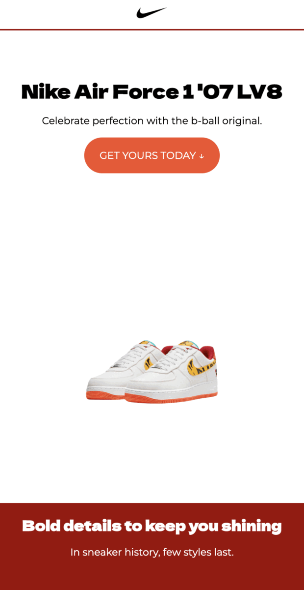

# Concept Product Landing Page 🚀🚀🚀

A concept product landing page for Nike Air Force 1 '07 LV8 built with HTML & CSS. 

This page was built during a web development webinar session that covered Responsive Site Layouts. The practices covered while building this are:

- Creating two-dimensional site layouts using [CSS Grid](https://css-tricks.com/snippets/css/complete-guide-grid/).
- Creating one-dimensional element layouts using [Flexbox](https://css-tricks.com/snippets/css/a-guide-to-flexbox/).
- Changing elements behaviors on different devices, by making use of [Media Query](https://css-tricks.com/**a**-complete-guide-to-css-media-queries/) breakpoints.

## Desktop 🖥

## Mobile 📱

## Contributing 👋

When contributing to this repository, please first discuss the change you wish to make via issue, email, or any other method with the owners of this repository before making a change.

Please note that there is a code of conduct, please follow it in all your interactions with the project.

1. Ensure any install or build dependencies are removed before the end of the layer when doing a build.

2. Update the README.md with details of changes to the interface, this includes new environment variables, exposed ports, useful file locations and container parameters.

## Authors 💻

- **Malcolm R. Kente** - _Initial work_ - [reMRKable Dev](https://remrkabledev.com/)